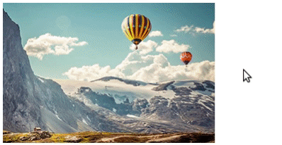

# jquery.dynamicPreview
Плагин для создания динамических превью из набора изображений


## Использование
Изображения для превью должны располагаться в одной директории (быть доступными по одному URL) и нумероваться
последовательно, начиная со `startIndex` (по умолчанию `1`) в количестве равном `count`. 
```
$('.js-dynamic-preview').dynamicPreview(options);
```
При применении к тегу `img` будет происходить замена атрибута `src`. При применении к иным тегам - замена фонового
изображения.

### Настройка
* **url** - URL-адрес изображений;
* **prefix** - приставка перед генерируемым именем изображений;
* **suffix** - окончание генерируемого имени;
* **count** - общее количество изображений;
* **startIndex** - стартовый индекс (по умолчанию `1`);
* **zeroPad** - дополнение индекса предшествующими нулями (по умолчанию `false`);
* **autoMode** - автоматическая обработка событий `mouseover` и `mouseout` (по умолчанию `true`);
 при отключении запускать и останавливать смену кадров необходимо с помощью методов `start` и `stop`;
* **default** - превью по умолчанию, если не задано будет ипсользовано изображение, установленое при создании страницы;
* **delay** - задержка при смене изображений.

Существует 3 варианта настройки плагина:
* установка настроек по умолчанию `$.fn.dynamicPreview.defaults = {...}`;
* передача настроек в момент инициализации `$('.js-dynamic-preview').dynamicPreview({...});`
* указание настроек в `data-` параметрах элемента `data-dynamic-preview-*`.

### Методы
Самостоятельно запустить смену изображений можно с помощью метода `start`:
```
$('.js-dynamic-preview').dynamicPreview('start', options);
```

Если элемент до этого не был инициализирован, можно передать настройки вторым параметром. При этом `autoMode` всегда
будет равен `false`.

Самостоятельно остановить смену изображений можно с помощью метода `stop`:
```
$('.js-dynamic-preview').dynamicPreview('stop', options);
```
